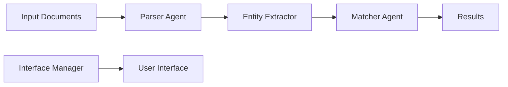

# RecruitX Documentation

## Overview
RecruitX is a zero-budget, AGI-level recruitment matching system that leverages state-of-the-art practices and the Google Gemini API to revolutionize talent acquisition.

## Table of Contents
1. [Getting Started](#getting-started)
2. [Architecture](#architecture)
3. [Components](#components)
4. [API Reference](#api-reference)
5. [Security](#security)
6. [UI/UX Guidelines](#uiux-guidelines)
7. [Testing](#testing)
8. [Contributing](#contributing)
9. [Troubleshooting](#troubleshooting)

## Getting Started
### Prerequisites
- Python 3.12+
- Google Gemini API access
- 16GB RAM recommended
- MacOS/Linux environment

### Installation
```bash
# Clone the repository
git clone https://github.com/your-org/recruitx.git

# Create virtual environment
python -m venv venv
source venv/bin/activate  # or `venv\Scripts\activate` on Windows

# Install dependencies
pip install -r requirements.txt

# Set up environment variables
cp .env.example .env
# Edit .env with your Gemini API keys
```

### Quick Start
```python
from recruitx import RecruitX

# Initialize the system
rx = RecruitX()

# Process a resume
result = rx.match_resume("path/to/resume.pdf", "path/to/job.pdf")
print(result.score)  # Matching score
```

## Architecture
RecruitX follows a multi-agent architecture with these key components:

### Core Components
1. **Parser Agent**
   - Document processing
   - Text extraction
   - Structure analysis

2. **Entity Extractor**
   - Skill identification
   - Experience analysis
   - Education verification

3. **Matcher Agent**
   - Profile comparison
   - Score computation
   - Ranking generation

4. **Interface Manager**
   - UI components
   - State management
   - Analytics tracking

### Data Flow


## Components

### Parser Agent
The Parser Agent handles document processing using state-of-the-art techniques:
- PyMuPDF for native PDFs
- DONUT for scanned documents
- Gemini API for enhanced interpretation

### Entity Extractor
Leverages Gemini API and FLAIR for:
- Named Entity Recognition
- Skill classification
- Experience validation

### Matcher Agent
Implements advanced matching using:
- Semantic similarity
- Multi-criteria evaluation
- Gemini-powered insights

### Interface Manager
Modern UI/UX implementation with:
- Component-based architecture
- Error boundaries
- Performance monitoring
- Analytics tracking

## API Reference

### RecruitX Class
```python
class RecruitX:
    def __init__(self, config: Optional[Config] = None):
        """Initialize RecruitX system.
        
        Args:
            config: Optional configuration
        """
        pass

    def match_resume(
        self,
        resume_path: str,
        job_description_path: str
    ) -> MatchResult:
        """Match resume against job description.
        
        Args:
            resume_path: Path to resume file
            job_description_path: Path to job description
            
        Returns:
            Match result with score and insights
        """
        pass
```

## Security
RecruitX implements comprehensive security measures:

### Authentication
- Zero-trust architecture
- Role-based access control
- JWT-based authentication

### Data Protection
- End-to-end encryption
- Data anonymization
- Audit logging

### Privacy
- GDPR compliance
- Data minimization
- Consent management

## UI/UX Guidelines

### Design Principles
1. **Accessibility First**
   - WCAG 2.1 compliance
   - Screen reader support
   - Keyboard navigation

2. **Responsive Design**
   - Mobile-first approach
   - Adaptive layouts
   - Device optimization

3. **Performance**
   - Sub-100ms interactions
   - Efficient rendering
   - Resource optimization

### Component Library
- Forms with validation
- Data tables with sorting/filtering
- Interactive charts
- Error boundaries
- Toast notifications

## Testing

### Test Types
1. **Unit Tests**
   - Component testing
   - Function validation
   - Error handling

2. **Integration Tests**
   - API integration
   - Component interaction
   - State management

3. **Performance Tests**
   - Load testing
   - Stress testing
   - Memory profiling

### Running Tests
```bash
# Run all tests
python -m pytest

# Run specific test category
python -m pytest tests/unit/
python -m pytest tests/integration/
python -m pytest tests/performance/
```

## Contributing

### Development Setup
1. Fork the repository
2. Create a feature branch
3. Install development dependencies
4. Make changes
5. Run tests
6. Submit pull request

### Code Style
- Follow PEP 8
- Use type hints
- Document all functions
- Write unit tests

## Troubleshooting

### Common Issues
1. **API Rate Limiting**
   - Use multiple API keys
   - Implement caching
   - Add retries

2. **Memory Usage**
   - Enable batch processing
   - Implement cleanup
   - Monitor resources

3. **Performance**
   - Check monitoring metrics
   - Review error logs
   - Optimize queries

### Support
- GitHub Issues
- Documentation
- Community Forum

---

## Version History
- v1.0.0 - Initial release
- v1.1.0 - Enhanced analytics
- v1.2.0 - Security improvements
- v1.3.0 - UI/UX refinements

## License
MIT License - see LICENSE file for details

## Acknowledgments
- OpenManus project
- Google Gemini team
- Open source community 